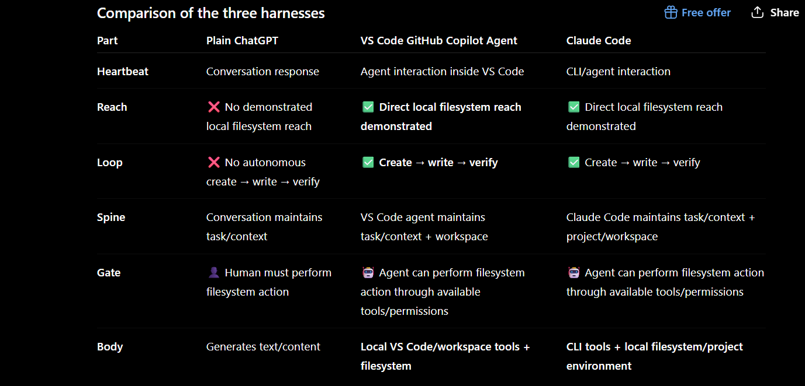

# Project 5 — One Task, Two Harnesses

## Evidence status

This document contains **two different kinds of evidence** — do not conflate them:

| | Status | Source |
|---|---|---|
| **Claude Code vs VS Code GPT extension** | Tested by Claude Code | Real tool calls in this session — files created, read back, and verified (see `claude-code-observations.md`, `claude-code-test/agent-test-observations.md`, and the empty `chatgpt-test-output/` folder) |
| **Plain ChatGPT chatbot conversation** | Manually observed by the human, not yet added | A separate reference comparison run by the human outside this tool. Not tool-verified. To be added later as its own section with a clear citation — it is **not** the "Harness B" used below |

## Task

Both harnesses were given the same low-stakes task: create `hello.txt` and `notes.txt` in the project test directory and complete the task. (A second, richer task — plan → execute → verify → correct — was also run against Claude Code only; see `claude-code-test/agent-test-observations.md`.)

## Harnesses

- **Harness A:** Claude Code (tested)
- **Harness B:** VS Code GPT extension, `vscode-chat-gpt` by ikasann-self (tested — real evidence: `chatgpt-test-output/` remained empty after the request)

> Cowork and ChatGPT Work were never tested (see `observations/not-used/`). A plain ChatGPT chatbot conversation is a separate, human-run reference — not Harness B, and not yet added to this file.

## Six-Part Shape

| Part | Claude Code | VS Code GPT |
|---|---|---|
| **Heartbeat** | Discrete progress signals during tool execution. | Discrete GPT response. |
| **Reach** | Direct filesystem access; created and read project files. | No direct filesystem creation observed. |
| **Loop** | Create → write → verify executed autonomously. | No autonomous filesystem loop; human had to perform the file operation. |
| **Spine** | Maintained task sequence across tool calls. | Maintained the request/response context but did not execute a multi-step filesystem sequence. |
| **Gate** | Filesystem operation proceeded through available tool permissions. | Human was required to create/copy the files locally. |
| **Body** | Agent + filesystem tools (Bash/Write). | VS Code GPT code-generation utility. |

## Three Implementation Differences

### 1. Reach

Claude Code could directly reach the local filesystem and create the requested files. The VS Code GPT extension did not demonstrate direct filesystem access during the test.

### 2. Loop

Claude Code executed the complete create → write → verify sequence. VS Code GPT stopped at generating assistance, so the human had to perform the local file operation.

### 3. Gate

Claude Code's available tools allowed the task to proceed without the human manually creating the files. With VS Code GPT, the human remained the execution gate.

## Test 2 Evidence (Claude Code only): Loop and Spine Under a Plan → Execute → Verify → Correct Task

Test 1 above only exercised a single linear pass (create → write → verify). A
second, richer task was run — plan → execute → verify → correct — to get
real evidence on Loop and Spine specifically. Full narration:
`claude-code-test/agent-test-observations.md`.

- **Loop**: Claude Code wrote a plan file first, executed it in the planned
  order, then read all outputs back to verify them against the plan. The
  "correct" branch of the loop was **not actually exercised** — nothing was
  wrong on the first pass, so no correction occurred. This is an honest gap:
  the run demonstrates plan→execute→verify, not yet verified self-correction.
- **Spine**: Confirmed directly — `notes.md`'s own content correctly described
  the order of the prior two file-writes, which is only possible if state
  persisted across the tool calls within the run (nothing was re-read from
  disk to reconstruct that order).

No equivalent Test 2 run exists yet for the VS Code GPT extension.

## Conclusion

The implementation differs substantially, but the same six-part shape remains visible underneath:

**Heartbeat → Reach → Loop → Spine → Gate → Body**

The comparison is therefore about the **harness and its capabilities**, not simply about which model produced the text.
---

### Comparison of the three harnesses

### Claude Code / VS Code GitHub Copilot Agent

*Instruction → Agent reasoning → filesystem reach → create files → read/verify → report result*

### Plain GPT

*Instruction → Agent reasoning → generated the requested content → human performed the filesystem operation → result*